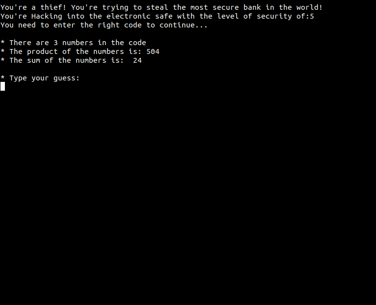

# TripleX
  
  TripleX is a terminal puzzle game about figuring out the correct sequence based on a piece of information! 

## How it works?
You have a limited number of tries to get access to the next level   
you need to discover the three numbers only knowing the product of then and the sum of them
when you get access to a next level you reset the number of tries you have
but you increase the difficulty

## Running the game🎮
You need to download the TripleX.c file and compile in a compiler of your preference,
If you are using ubuntu you can download the gcc/g++ compiler by putting the following command on terminal and hitting enter:
    
    $ sudo apt install g++
    
or

    $ sudo apt install build-essential
    
after compiling just play it! 😜
